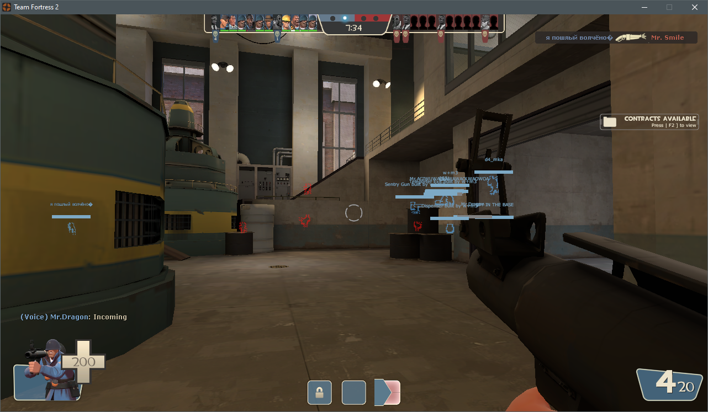
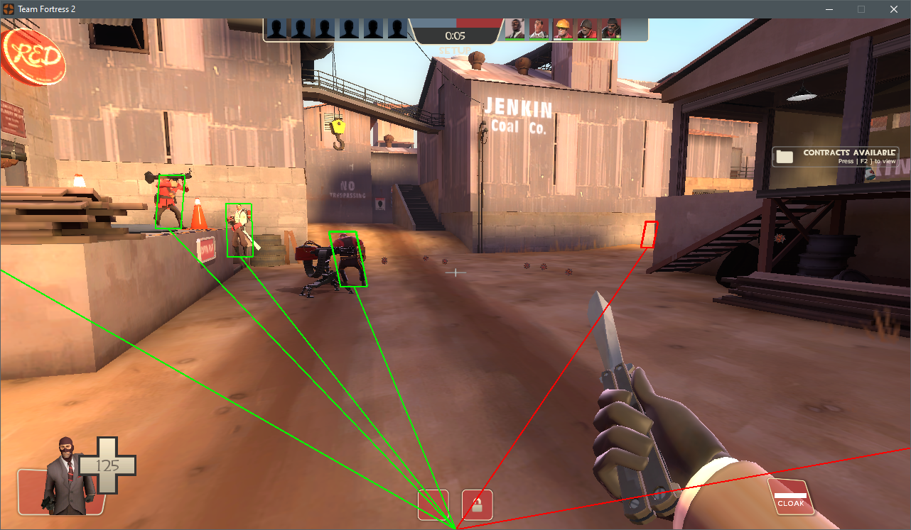

# Unfair Edge: A Low-Level Manipulation of Game Memory with Bypassing VAC

This repository hosts the code submitted as a dissertation project for MSc. Computer Science, School of Computer Science, in University of Birmingham (2020/21).

The project will focus on ”Team Fortress 2,” a popular multiplayer FPS game that uses Valve Anti-Cheat system (VAC).

This repository contains:

	* StandardWINAPI - Contains code for external implementation of cheats
	* InternalDLL - Contains code for internal implementation of cheats
	* DLLInjection - Contains code for injecting the DLL using LoadLibrary
	* ManualMapInternalDLL - Contains code for injecting the DLL through manual mapping
	* ExecutableFiles - Contains all the built files

## Ethical Considerations

Attention to different ethics regulations is a critical responsibility prior to the start of the project. It should be noted that official servers are not the optimal environment for testing and debugging cheats due to a number of usability issues. As a result, tests are conducted using the game's single-player bot player versus environment (PVE) mode on unofficial servers or without a server at all. Anti-Cheat testing, unlike cheat testing, must be performed on VAC-secured servers, ideally official servers, in order to duplicate the VAC's effectiveness against cheaters in a real-world situation. Any online tests will be documented, including the technique used, ethical limitations applied, and account information, so that anyone can confirm that the in-game statistics match the reported behaviour. Any exploits found in VAC will only be revealed to Valve and made public with its authorization. Any features that hinder VAC will be removed from the exploits, although the underlying cheat will remain intact. This ensures that the cheat is solely distributed for educational purposes and not for the aim of leaking information about the anti-cheat system.

## To Run:

To execute the application, individuals must first download a version of Visual Studio, then select the C++ Developer Package from the drop-down menu during installation; it is recommend to get the free Community Edition: visualstudio.microsoft.com/. It is now necessary to download Steam in order to obtain the game via the following link: https://store.steampowered.com.

Installing the Steam, will enable Steam to run in Windows. Login using the credentials, proceed to download 'Team Fortress 2' while navigating around the 'Store' using the search option. Open the game with the option 'Play', the menu of the game provides different types of matchmaking. 

It is now recommended to try to run the application with 'Training' rather than 'Casual' matches. As the VAC is active, navigate through the directory to find the application 'ManualMapInternalDLL.exe'. Run the program with a argument that includes the path of the DLL which can be found in the same directory. The following can be seen as an example command:

```
.\ManualMapInternalDLL.exe  "\Path\to\DLL\InternalDLL.dll"
```

To run the external cheats and injection with LoadLibrary, add an '-insecure' launch flag after navigating through the options in steam.

## Results

The following are a sample of results produced in the term of testing and playing with the cheats.

### GlowObjectManger



### ESP


